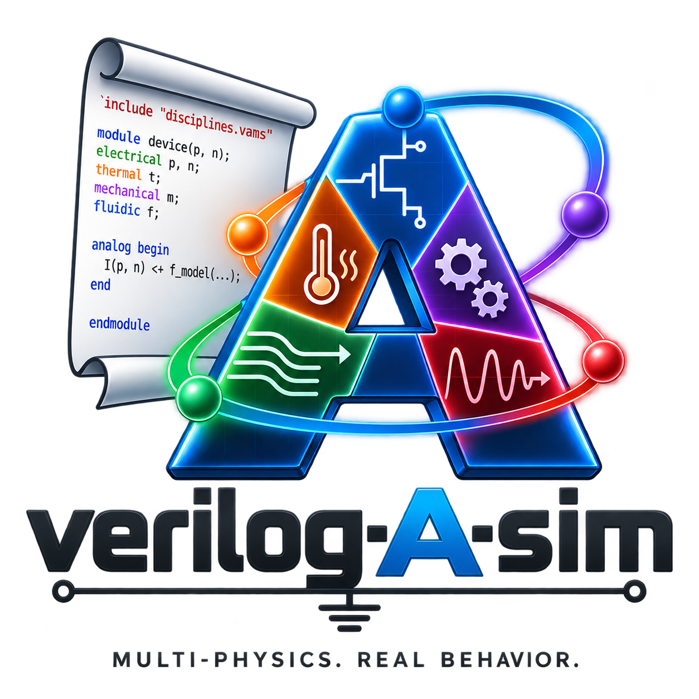

# verilog-a-sim

---



---

A clean-room, from-scratch Verilog-A circuit simulator written in pure Rust, built as a
coordinated set of master's theses. It compiles Verilog-A — the full language is the target,
and `docs/token-reference.md` records construct by construct how far the implementation is
from it — to automatically differentiated model instances and solves them with an MNA / Newton
core: DC operating point and sweep, transient, AC and noise, validated against QSPICE to stated
tolerances. Multi-physics comes from Verilog-A disciplines: the model zoo has electrical,
thermal, mechanical and optical examples solved in one system.

```
 Verilog-A source                         circuit netlist
        │                                        │
   [va-frontend]  ──IR (Interface α)──►  [va-codegen]      [va-netlist]
   lex/parse/elab                        IR → AD → models       │
                                                │               │
                                          ModelInstance (Interface β)
                                                │               │
                                                ▼               ▼
                                    ┌──────────────────────────────────┐
                                    │            [va-core]             │  ← depends ONLY
                                    │   MNA · Newton · linsolve · conv │    on Interface β
                                    └──────────────────────────────────┘
                                       │              │            │
                                 [va-transient]  [va-acnoise]   [va-cli]
                                                                    │
                                                              [va-harness] ─► vs QSPICE
```

## Build & test

```bash
cargo build --workspace
cargo test  --workspace
cargo clippy --workspace --all-targets -- -D warnings
cargo fmt --all
cargo xtask validate        # run va-harness over the model zoo vs golden/
cargo xtask gen-golden      # (re)generate golden outputs from QSPICE, if installed
cargo run -p va-cli -- sim circuits/divider.net --model models/resistor.va
```

## Running a simulation

A run takes a Verilog-A model (`models/*.va`, the component), a SPICE-flavoured deck
(`circuits/*.net`, the testbench: instances, sources, and the analysis card), and one command:

```bash
cargo run -p va-cli -- sim circuits/rectifier.net --model models/diode.va --tran
```

There is no separate elaborate step — `sim` lexes, parses, elaborates, differentiates and
solves in one invocation. `docs/workflow.md` walks through it and says what changes at 1.0,
when the deliverable becomes a compiled `va-cli` executable tested across platforms.

See `CLAUDE.md` for the project constitution and `docs/` for the frozen interfaces,
architecture, thesis map, and validation plan; `release.txt` carries the release log and the
road to 1.0, and `docs/future_development.md` what comes after it.
