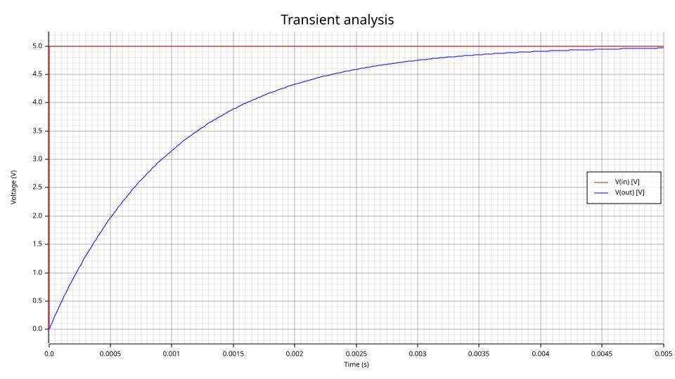
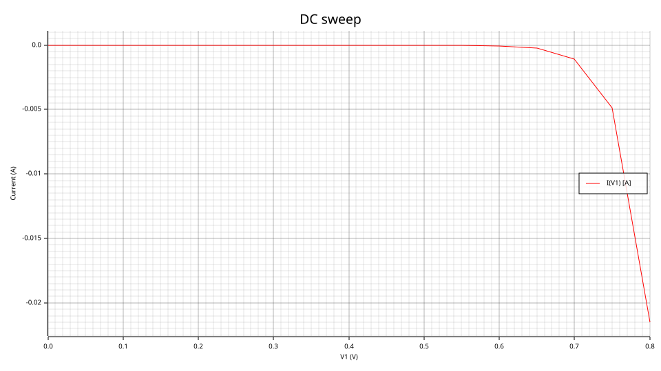
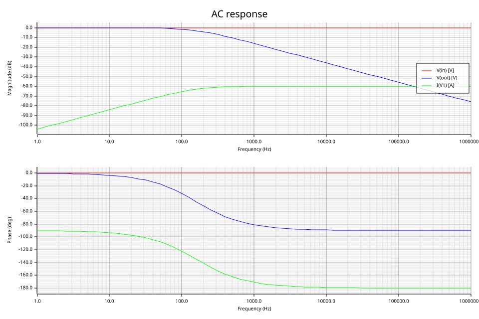
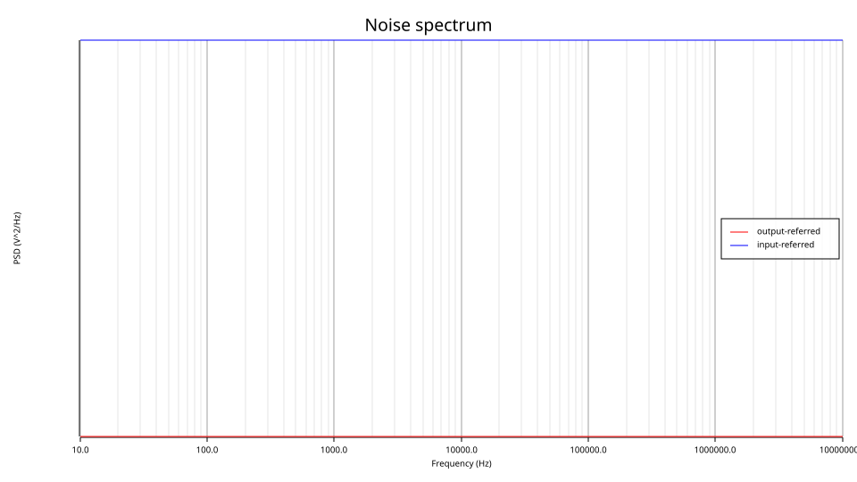
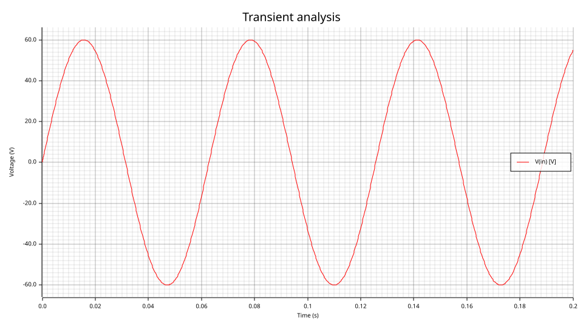
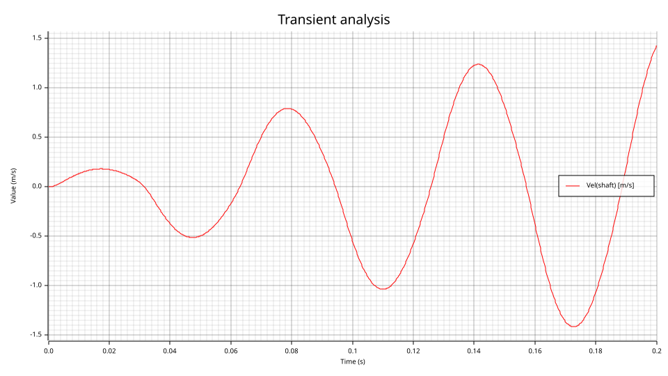
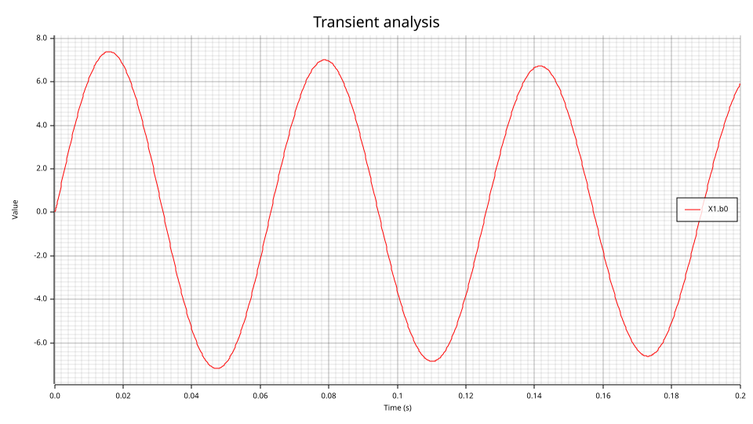

# Worked examples

Seven plots covering all four analyses, produced by `va-cli --plot` from decks that live in
this repository. Every command below is reproducible as written; the SVGs in `docs/examples/`
were generated by exactly these invocations.

Each plot is annotated with what to look for and, where there is one, the closed-form value it
should match. A picture that merely looks plausible is not evidence — the numbers are.

---

## 1. RC step response — transient

```bash
va-cli sim circuits/rc_step.net --tran --report in,out --plot docs/examples/rc_step.svg
```



Bring-up rung 3. A 5 V step into 1 kΩ / 1 µF, so `V(out) = 5(1 − e^(−t/RC))` with RC = 1 ms —
about 3.16 V at t = 1 ms. Validated against QSPICE at 2.248e-5 RMS.

`--report in,out` selects the two voltages. Without it the plot would also carry `I(V1)`, and
amperes and volts share no axis: the y-axis label falls back to a bare `Value` whenever the
selected series do not agree on a unit, rather than claiming one of them.

## 2. Diode I–V — DC sweep

```bash
va-cli sim circuits/diode_iv_params.net --model models/diode.va --report V1 \
  --plot docs/examples/diode_iv.svg
```



`--report V1` picks the source's branch current, which is what makes this an I–V curve rather
than a plot of the swept voltage against itself. The current is negative because a source's
branch current is measured into its `+` terminal, so a forward-conducting diode draws it out.

The deck sets `Is` and `N` on the device line rather than taking the model defaults, so the
knee moves visibly — that is what makes it a gate: an override silently dropped would show up
as the wrong knee, not as a crash.

## 3. RC low-pass — AC

```bash
va-cli sim circuits/rc_ac.net --ac --plot docs/examples/rc_ac.svg
```



Magnitude and phase, log frequency. `H = 1/(1 + jωRC)`, so −3 dB at
`f = 1/(2πRC) = 159.15 Hz`, rolling off at −20 dB/decade with phase approaching −90°. Validated
against QSPICE to 1.3e-15 in magnitude.

All three quantities are shown here, including `I(V1)`. On a dB axis that is legitimate in a way
it is not on a linear one: decibels are a ratio, so the unit belongs on the series name (the
legend reads `V(out) [V]`, `I(V1) [A]`) rather than on the axis.

## 4. Diode noise — noise spectrum

```bash
va-cli sim circuits/diode_noise.net --noise --plot docs/examples/diode_noise.svg
```



Output-referred and input-referred PSD. The spectrum is flat because both contributors are
white — the diode's shot noise (`2qI`) and the resistor's thermal noise (`4kT/R`) — which is
also why the per-device split in the text report comes out 66.7 % / 33.3 % rather than something
frequency-dependent.

---

## Cross-domain: an actuator driving a sprung mass

The remaining three plots are one simulation: `models/actuator.va` (a voice-coil actuator, R-L
winding with back-EMF and a `tanh`-saturated force law) driving `models/spring_load.va` (mass,
spring, damper), wired together by `models/actuator_plant.va` and driven by `models/vsin.va`.

The mechanical load resonates at `ω0 = sqrt(k/mass) = sqrt(5000/0.5) = 100 rad/s` exactly —
`f0 = 15.9155 Hz` — with `Q = 10`. The drive sits on that resonance.

**Three plots rather than one, on purpose.** A single canvas cannot honestly carry ±60 V and
±2.4 m/s: one series would be a flat line at this scale, and no y-axis label would be true of
both. `--report` selecting one quantity per plot is the answer, and it is the same selection the
text report uses, so chart and table never disagree about which series exist.

### 5. The electrical drive

```bash
va-cli sim circuits/actuator_plant.net --model models --tran --report in \
  --plot docs/examples/actuator_drive.svg
```



A clean 60 V, 15.9155 Hz sine from `models/vsin.va`, which computes it as
`ampl*sin(2π*freq*$abstime)` — a pure function of simulation time, carrying no state and
contributing nothing to the Jacobian.

### 6. The mechanical response

```bash
va-cli sim circuits/actuator_plant.net --model models --tran --report shaft \
  --plot docs/examples/actuator_velocity.svg
```



`Vel(shaft)` in m/s — **not** `V(shaft)` in volts. The label and units come from the
`kinematic_v` discipline's own potential nature, resolved through `va_ir::NodeDecl::access`;
reporting a mechanical node as a voltage would be a false statement about what was solved, not
a cosmetic slip.

The envelope grows over the window rather than starting at full amplitude: 200 ms is exactly one
mechanical time constant (`τ = 2Q/ω0 = 0.2 s`), so the resonance reaches only ~63 % of its final
value here. Extending `.tran` to ~1.5 s settles it at 2.413 m/s, against 2.414 m/s from
first-harmonic balance.

### 7. The coil current, and the coupling

```bash
va-cli sim circuits/actuator_plant.net --model models --tran --report X1.b0 \
  --plot docs/examples/actuator_current.svg
```



`X1.b0` is the actuator's coil current. The opaque name is a known limitation rather than an
oversight: it is an auxiliary row `va-codegen` allocated for a potential contribution, and
Interface α records only a discipline's *potential* nature, so the flow's own access function
and units are not available to the reporter. It is deliberately printed with a bare name and no
unit rather than guessed at as `I(...)`/`A` — a branch row does carry a flow, but an `idt`
accumulator carries that flow's time integral, and labelling the two alike would be confidently
wrong about half of them.

That it really is the coil current is checkable from the actuator's own equation. At
t = 0.1754 s the run gives `V(in) = −57.97 V`, `Vel(shaft) = −1.3675 m/s`, `X1.b0 = −6.43 A`,
and `R·I + kb·v = 8(−6.43) + 5(−1.3675) = −58.28 V` — the remaining 0.3 V being the `L·dI/dt`
term.

**What the coupling looks like in numbers.** The three plots together show a two-way coupling,
which is the point of the model set; the sharpest evidence is not in any single picture but in
how the current moves with frequency:

| drive | coil current | shaft velocity |
|---|---|---|
| 1.59 Hz (well below `f0`) | 0.250 A | 0.0025 m/s |
| **15.92 Hz (at `f0`)** | **0.154 A** | **0.154 m/s** |
| 63.66 Hz (well above `f0`) | 0.249 A | 0.0066 m/s |

The current *falls* at resonance, exactly where the mechanical amplitude peaks, because the
shaft's velocity feeds back as back-EMF and appears to the source as added impedance. A one-way
coupling — an electrical circuit driving a mechanical one that never answers — would show no
such dip. Measured at 2 V drive against small-signal theory
(`Zm = d + j(ω·mass − k/ω)`, `Ze = (R + jωL) + kb·Kf/Zm`), the currents agree to 4–6 digits
across two decades.

At the 60 V of these plots the force law is hard into saturation, `tanh(I/i0) ≈ 0.996`, so the
force is clipped at 9.95 N against its 10 N limit while the current is not visibly clipped.
Predicting that regime needs first-harmonic balance, not a sinusoidal assumption: a saturated
force is nearly a square wave, whose fundamental is 4/π larger than its own amplitude. Assuming
otherwise predicts 1.99 m/s and is wrong by 21 %.

---

## Regenerating these

All seven, from the repository root:

```bash
D=docs/examples
va-cli sim circuits/rc_step.net --tran --report in,out --plot $D/rc_step.svg
va-cli sim circuits/diode_iv_params.net --model models/diode.va --report V1 --plot $D/diode_iv.svg
va-cli sim circuits/rc_ac.net --ac --plot $D/rc_ac.svg
va-cli sim circuits/diode_noise.net --noise --plot $D/diode_noise.svg
va-cli sim circuits/actuator_plant.net --model models --tran --report in    --plot $D/actuator_drive.svg
va-cli sim circuits/actuator_plant.net --model models --tran --report shaft --plot $D/actuator_velocity.svg
va-cli sim circuits/actuator_plant.net --model models --tran --report X1.b0 --plot $D/actuator_current.svg
```

SVG only, and deliberately: `plotters`' bitmap backend pulls in font-rasterization dependencies
with native-link components, which CLAUDE.md §5 forbids.
