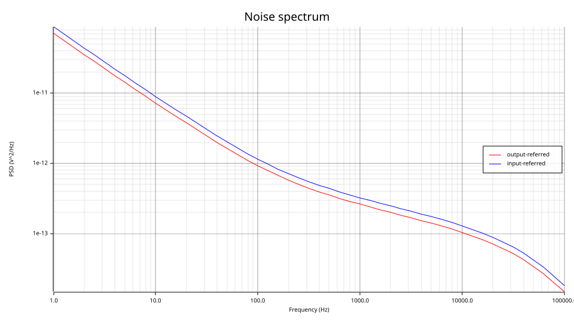
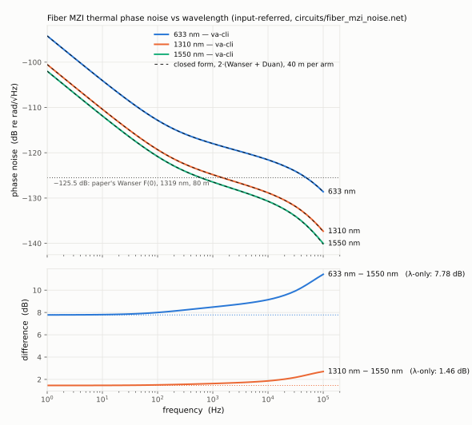
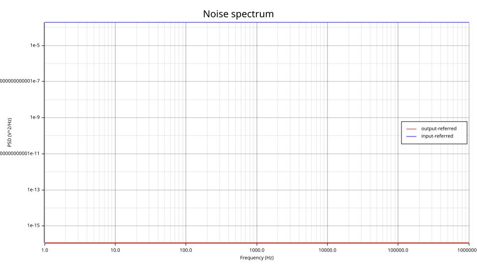

# Photonic noise: three papers, as models (2026-09-14)

Three papers in `references/` describe the noise floors of interferometric and resonant
photonic sensors. This document says how each paper's physics is written in the model zoo,
which line of which model carries which equation, what a `.noise` run of the two example decks
reports against the papers' own numbers, and what is deliberately left out. It is the companion
to `models/waveguide.va`, `mzi.va`, `splitter.va`, `ring_gyro.va`, the RIN in `cw_laser.va`, the
shot noise in `photodiode.va`, and the decks `circuits/fiber_mzi_noise.net` and
`circuits/ring_gyro_noise.net`.

The short version: **a phase net, and the noise machinery the simulator already had.** The
papers' noise sources are phase-noise power spectral densities on a guided wave (Glenn, Wanser,
Duan) and current-noise densities at a detector (Scheuer). `photonic.vams` gained an
`optical_phase` discipline so a phase can travel on a net; the three sources on it are written
with the LRM's own `noise_table_log` and `flicker_noise`; an interferometer's Jacobian carries
`dP/dφ`; and the existing adjoint noise analysis, per-device attribution and input-referred
column do the rest. Nothing photonic was added to any crate. Two things *were* added to the
crates, because the models exposed them as bugs — see §5.

---

## 1. The papers

| Paper | What it derives or measures | Where it lives here |
|---|---|---|
| **Glenn**, "Noise in interferometric optical systems: an optical Nyquist theorem", IEEE JQE 25 (1989) 1218 | The index of a medium above 0 K fluctuates thermodynamically (temperature and density), giving a guided wave a phase-noise PSD ∝ L. Temperature process: diffusive, < 1 MHz. Density process: acoustic, peaks ~500 MHz. Both can exceed the shot-noise limit. | `waveguide.va` (temperature process, in Wanser's finite-cladding form); density process **not** modelled (§4) |
| **Bartolo, Tveten, Dandridge**, "Thermal phase noise measurements in optical fiber interferometers", IEEE JQE 48 (2012) 720 | Measures a 40 m + 40 m MZI at 1319/1550 nm from 1 Hz to 100 kHz against Wanser's closed form (eq. 2–4), Foster's, and Duan's thermomechanical 1/f term (eq. 5); Appendix B: how the differential readout at quadrature cancels laser intensity noise. Table II: every fiber parameter. | `waveguide.va` (Wanser + Duan, Table II defaults), `mzi.va` (eq. B2 as the Jacobian), `splitter.va`, `circuits/fiber_mzi_noise.net` |
| **Scheuer**, "Quantum and thermal noise limits of coupled resonator optical waveguide and resonant waveguide optical rotation sensors", JOSA B 33 (2016) 1827 | Sagnac phase in a rotating ring (eq. 13); sensitivity `S = (1/P_in) dP_out/dΩ` (eq. 14); minimum detectable rotation rate from detector shot noise, load thermal noise and laser RIN (eq. 15); which one dominates decides how to optimize the ring (Figs. 9–11). | `ring_gyro.va` (eq. 13 in the round-trip phase), `photodiode.va` (shot), `resistor.va` (Johnson, already there), `cw_laser.va` (RIN), `circuits/ring_gyro_noise.net` (eq. 14 by `.dc`, eq. 15 by `.noise`) |

## 2. Equations → model lines

### 2.1 Thermorefractive phase noise — `waveguide.va`

Wanser's spectral function, as Bartolo write it (their eq. 2–3, with `4π` folded in so that the
model declares a one-sided density in rad²/Hz — their eq. 1 is `φ_rms/√Hz = √(4π S_φφ)`):

```
S_φ(f) = (2π k_B T² L / (κ λ²)) · (dn/dT + n α_L)² · ln[ (k_max⁴ + (2πf/D)²) / (k_min⁴ + (2πf/D)²) ]
k_max = 2/w₀        k_min = 2.405/a_f        S_φ(0) → … · 4 ln(k_max/k_min)
```

It is flat below the cladding corner `f_min = D k_min²/2π` (472 Hz for 80 µm fiber), falls
logarithmically to the core corner `f_max = D k_max²/2π` (77 kHz at 1550 nm), and as `1/f²`
above. Glenn's infinite-cladding temperature process is the same function without the `k_min`
term; Bartolo's Fig. 2 shows the two agree above 1 kHz.

The function is neither white nor a power law, so the model **tabulates** it:

```verilog
`define SPHI(f) (`WANSER_A * ln((`KMAX4 + pow(`M_TWO_PI*(f)/D, 2.0)) / (`KMIN4 + pow(`M_TWO_PI*(f)/D, 2.0))))
Phi(phout) <+ Phi(phin) + `M_TWO_PI*n*L/lam
    + noise_table_log({ 1.0, `SPHI(1.0), 1.3335, `SPHI(1.3335), … , 1.0e9, `SPHI(1.0e9) }, "thermorefractive")
    + flicker_noise(`DUAN, 1.0, "thermomechanical");
```

73 points, 8 per decade, 1 Hz–1 GHz, each the closed form evaluated from the instance's own
parameters. Log-log interpolation between them tracks the closed form to **0.7 % worst case**
(at `f_max`; it would be 2.6 % at 4 points/decade — measured against the formula over
1 Hz–10 MHz). Below 1 Hz the table clamps to its 1 Hz value, which is `S_φ(0)` to all digits;
above 1 GHz it clamps where the truth keeps falling, so a sweep past 1 GHz over-reports.

### 2.2 Thermomechanical 1/f phase noise — `waveguide.va`

Duan (Electron. Lett. 46, 2010) via Bartolo eq. (5):

```
S_φ(f) = (2πn/λ)² · 2 k_B T L φ₀ / (3π E₀ A f)        A = π (d_coat/2)²
```

An exact `flicker_noise(coeff, 1.0)`. Bartolo's data are "consistent with" it between 20 Hz
and 1 kHz, no stronger; the loss angle `φ₀` is unmeasured below 75 kHz and the formula is only
claimed for `f < √(E₀/ρ)/2L` (45 Hz for 80 m), yet their fit uses it to 1 kHz. **With
Table II's values as printed, eq. (5) gives −120.6 dB re rad/√Hz at 100 Hz where the paper
quotes −124.4 dB**; the 3.8 dB is not recovered from the printed parameters and the model does
not pretend otherwise. `phi0 = 0` disables the term.

### 2.3 Phase → intensity — `mzi.va`

```
P₁ = il · [ (P_a + P_b)/2 + √(P_a P_b) cos(φ_a − φ_b + bias) ]
P₂ = il · [ (P_a + P_b)/2 − √(P_a P_b) cos(φ_a − φ_b + bias) ]
```

The AD Jacobian's `∂P₁/∂φ_a = −il √(P_a P_b) sin(Δφ)` is Bartolo's eq. (B2): at quadrature
(`bias = π/2`, the default) the phase response is maximal and the two outputs are
anti-correlated in phase and correlated in intensity, which is what lets a difference amplifier
(`E1` in the deck) cancel the laser's RIN and double the phase signal. The 2π·n·L/λ static
phases of two identical arms are bit-identical and cancel; `bias` is the PZT you would use to
set the operating point otherwise. Nothing searches for quadrature — a deck states it.

### 2.4 Sagnac phase and the noise budget — `ring_gyro.va`, `photodiode.va`, `cw_laser.va`

Scheuer eq. (13) with `ω = 2πc/λ`, applied to the round-trip phase of an all-pass ring:

```
φ = 2π n_eff L/λ  +  4π² R² Ω / (λ c)          Ω = V(rot)   [rad/s per volt]
T_thru(φ) = (a² − 2ra cos φ + r²) / (1 − 2ra cos φ + r²a²)
```

The rotation rate is a *voltage* on a control node because both of the gyro questions are
source questions in this netlist format: `.dc Vrot …` sweeps `P_thru(Ω)` (eq. 14's `S` is its
slope over `P_in`), and `.noise V(out) Vrot` refers the output noise to Ω, so `√S_in` in
(rad/s)/√Hz **is** eq. (15)'s minimum detectable rotation rate per root-hertz — computed from
the deck's actual sources and actual linearized gain. Written out with `i_d = resp·T_D·P_in`:

```
Ω_min = (T_D / S) · √( (2e/i_d + 4kT/(R_L i_d²) + RIN) · Δf )
```

the `T_D/S` prefactor being what eq. (15)'s "1/S" means once `i_d` is expanded (it is what
makes Scheuer's "optimize `S/√T_D` when shot-limited, `S` when thermal-limited" come out).
The three terms are, respectively, `photodiode.va`'s `white_noise(2q(|I_j| + resp·P))`,
`resistor.va`'s existing `4kT/R`, and `cw_laser.va`'s `white_noise(rin·P²)` (`rin` linear,
1/Hz; a data-sheet −155 dB/Hz is `3.16e-16`).

A numerical trap the model states in place: the static round-trip phase is ~2180 rad and the
Sagnac term ~1e-10 rad per rad/s, below the static phase's floating-point resolution — a `.dc`
sweep read as exactly flat until the static phase was reduced modulo 2π *before* the Sagnac
term is added (`floor`'s derivative is zero, so `.noise`, which linearizes, was never wrong).

## 3. The two decks and their numbers (v0.9.21)

### 3.1 `circuits/fiber_mzi_noise.net` — Bartolo's Fig. 1

```bash
va-cli sim circuits/fiber_mzi_noise.net --model models --noise
```

1 mW at 1319 nm → splitter → two 40 m waveguides (Table II's 1319 nm column) → `mzi` at
quadrature → two 0.9 A/W photodiodes into 1 kΩ → `E1 = V(a1) − V(a2)`. `Vpzt` drives one arm's
control port at 1 rad/V, so the **input-referred column is the phase noise in rad²/Hz** and
`10·log10(S_in)` is the paper's dB re rad/√Hz.

| f | S_in (rad²/Hz) | dB re rad/√Hz | what it is |
|---|---|---|---|
| 1 Hz | 8.75e-11 | −100.6 | Duan 1/f (§2.2's caveat applies) |
| 1 kHz | 3.24e-13 | −124.9 | crossover; Wanser's flat region is −125.5 |
| 10 kHz | 1.29e-13 | −128.9 | Wanser's log roll-off between the corners |
| 100 kHz | 1.83e-14 | −137.4 | Wanser `1/f²` above `f_max` |
| shot noise, both detectors | 3.6e-16 | −154.5 | flat; 17–54 dB below the fiber |
| laser RIN (−140 dB/Hz, deliberately loud) | 0 | — | common-mode at quadrature, cancelled exactly |

Set `bias=1.5184` on the MZI (3° off quadrature, the paper's "φ ≈ 87°") and the RIN leaks
1.5 µV rms over the band — `cos²(3°)` of the single-ended figure, as (B2) says. Compare the
paper's Fig. 2: −125.5 dB flat below ~1 kHz, ~−140 dB at 100 kHz, a 1/f rise below 1 kHz
that their Fig. 4 attributes to Duan plus uncancelled intensity noise. Their shot-noise line is
−148.9 dB for 0.5 mW; two 0.9 A/W detectors at 0.5 mW each in the differential readout give
−154.5 dB (`q/(resp·P)` referred to phase), and no responsivity ≤ 1 A/W reproduces their figure
from 0.5 mW — quoted, not matched.



(The plot's axis says V²/Hz; the input-referred curve is rad²/Hz here because the input is a
1 rad/V source.)

**The paper's Fig. 3 — three wavelengths.** `docs/examples/fiber_mzi_wavelengths.py` runs the
deck at 633, 1310 and 1550 nm with `dn/dT` from the paper's eq. (A1) and `w0` from its Table II
(633 nm: the fiber is multimode there, V = 7.1, so the LP01 Marcuse estimate 1.95 µm is used
and the curve is the formula, not a possible measurement):



| | 1 Hz | 1 kHz | 100 kHz | vs 1550 nm at low f (λ-only `20 log(1550/λ)`) |
|---|---|---|---|---|
| 633 nm | −94.2 dB | −118.0 | −128.6 | +7.8 dB (7.78) |
| 1310 nm | −100.5 | −124.8 | −137.3 | +1.6 dB (1.46; paper: 1.4 + ~0.2 from `w0`) |
| 1550 nm | −102.0 | −126.5 | −140.0 | — |

The difference grows above 10 kHz because a smaller mode radius moves the `k_max` corner up —
the `w0` correction the paper calls "much smaller" at zero frequency is not small on the
`1/f²` tail. Closed forms overlay every curve within 1 %.

### 3.2 `circuits/ring_gyro_noise.net` — Scheuer's Fig. 1(a)

```bash
va-cli sim circuits/ring_gyro_noise.net --model models --noise
```

1 mW with −155 dB/Hz RIN → a 1 mm-radius ring (5 % coupler, 0.5 dB/cm, resonance at exactly
1550.000 nm, 1.8 pm wide) with the laser 0.53 pm up the flank (`T_D = 0.272`) → 0.9 A/W
photodiode → 1 kΩ. 0.245 mA of photocurrent.

| | value |
|---|---|
| output noise `S_V` | 1.14e-16 V²/Hz, flat |
| — photodiode shot `2q i_d` | 7.84e-23 A²/Hz (69 %) |
| — load Johnson `4kT/R` | 1.66e-23 A²/Hz (15 %) |
| — laser RIN `RIN·i_d²` | 1.89e-23 A²/Hz (17 %) |
| `dV/dΩ` (from a `.dc Vrot` sweep) | −7.8e-7 V per rad/s |
| input-referred `S_in` | 1.87e-4 (rad/s)²/Hz |
| **Ω_min/√Hz** | **0.0137 rad/s = 2820 °/h** |

Shot-limited, so this ring wants `S/√T_D` maximized (Scheuer §5). A 30 µm ring
(`ring_gyro.va`'s default geometry) gives 17 rad/s/√Hz — the Sagnac phase scales as `R²`,
which is why gyro rings are millimetres.



## 4. What is validated, and against what

Neither deck has a QSPICE golden: QSPICE has no phase net, no interferometer and no ring. Both
are validated against **closed forms evaluated independently in the test**, which is the
"validated vs closed form" tier `docs/validation.md` already uses for AC and `laplace_*`:

- `wanser_formula_reproduces_bartolos_quoted_figure` — the Rust transcription of §2.1 gives
  −125.5 dB at `f → 0` for Table II's 1319 nm column, and 1.6 dB more than the 1550 nm column
  (the paper: 1.4 dB from λ plus ~0.2 dB from the mode radius). The paper checks the formula
  before the simulator is involved.
- `fiber_mzi_noise_matches_wanser_and_duan_through_the_interferometer` — at every one of the
  51 frequencies, the two waveguides' share of the output noise referred to the PZT input equals
  `2·(Wanser + Duan)` within 1 % (the table's 0.7 %); each photodiode's share is
  `2q·(0.9·0.5 mW·10^(−0.0008) + I_s)·R²` to 1e-6 (the 0.008 dB is the arm's loss — a wrong
  "expected" the test itself first got wrong); the laser's share is `< 1e-40`.
- `ring_gyro_noise_is_scheuers_three_term_budget_referred_to_rotation_rate` — `S_V` equals
  `R²(2q(i_d + I_s) + 4kT/R + RIN i_d²)` with `i_d` read from the operating point, to 1e-6 (the
  photodiode's reverse conductance shunts the load by 4e-8, so that tolerance is real); each
  term is attributed to its device; `S_in = S_V/H²` with `H` measured by two *further* DC
  solves at ±100 rad/s, not taken from the analysis's own linearization; `Ω_min = 0.0137`.

Both decks are in the zoo (`check models --codegen`: 29/29) and run in the workspace tests.
They are **not** in `xtask validate`'s golden set — `docs/validation.md`, "Ungated circuits".

## 5. What the models found in the simulator

Two contract-level bugs, both of the silent-zero kind, both fixed with the models
(`docs/interfaces.md`, revision 2026-09-14):

1. **Noise in a potential contribution was dropped.** `V(p,n) <+ … + white_noise(…)` was
   emitted as a current source across `(p, n)` — into a node the same contribution pins — whose
   adjoint is identically zero. The source was listed as a contributor and delivered `0.0`
   (measured on a 1k/1k divider: `X1 0.0 (0.0%)` against a true 2.5e-13 V²/Hz). Every
   signal-flow net only ever receives potential contributions, so every photonic noise source
   would have been zero. It now sits on the branch's constraint row (a series source), and the
   divider reads `2.500083e-13` = `0.25·1e-12 + 4kT·500` exactly.
2. **`noise_table` powers were frozen at elaboration.** The table was const-folded, so a deck's
   `L=40` (or `R2 … 3000` on the tabulated resistor) left the default's PSD in place, silently.
   Powers are now lowered as constant *expressions* and evaluated per instance; frequencies
   stay folded (the sort needs numbers). `resistor_noise_table.va` and its deck no longer carry
   the "both resistors must be 1k" warning, and the 1k/3k case is a test.

## 6. What is left out, and why

- **Glenn's density (acoustic) process.** Needs `J₁` (no Bessel builtin in the language) and
  peaks near 500 MHz, three decades above the papers' bands; negligible below 1 MHz
  (Glenn's Fig. 4(a)).
- **Laser phase/frequency noise.** The phase net carries no transport delay, so a source's
  phase noise cancels *exactly* in any interferometer built here, whatever the path imbalance.
  Right for Bartolo's < 1 cm-matched MZI; wrong for an unbalanced one, where the laser floor
  scales with the imbalance (their Fig. 4(c): a DFB is 100 dB above the thermal noise at 1 Hz
  for 1 m). Declaring a source that can reach no output would be a silent zero, so
  `cw_laser.va` declares none and says so. The fix is `absdelay` on the phase net *and* an
  `absdelay` that is exact in noise analysis, which it is not (it is `H(0)` there — the same
  stated limitation as `laplace_*`).
- **The PSD's `1/λ²` uses `lambda0`, not the live wavelength net.** A table power must be a
  constant expression. 1.4 dB between 1319 and 1550 nm; set `lambda0` with the laser.
- **The ring's own thermorefractive noise.** A `waveguide`-type term of length L that
  Scheuer's RWOG budget does not include (his "thermal noise" is the load's Johnson noise); a
  deck can add it by routing the phase through a `waveguide` — the ring model does not take a
  phase input today.
- **Correlated sources, non-white RIN, 1/f in the photodiode.** The noise channel sums
  uncorrelated sources; a RIN spectrum with its 1/f^α rise and relaxation peak is a
  `noise_table_log` in place of the laser's `white_noise`; a PIN's 1/f is SPICE's `KF` form
  as in `diode_flicker.va`.
- **Fiber geometry for integrated waveguides.** `w0` is the mode radius and `a_f` the distance
  to the thermal boundary; the formula is the same physics but its cylindrical-cladding
  geometry is then an approximation. Table II's `D` is 2.5 % off its own `κ/ρC_v`; the model
  takes both as parameters and says so.
