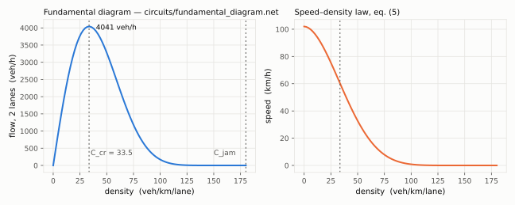
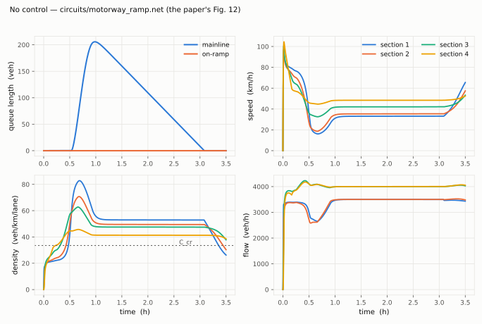
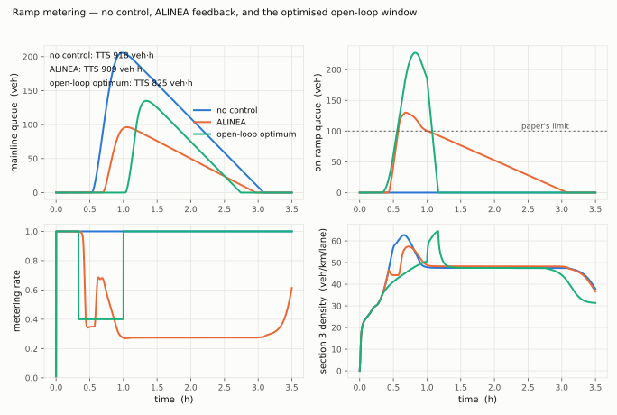

# Macroscopic traffic as a circuit, and what ramp metering can and cannot do (2026-09-15)

Bellemans, De Schutter and De Moor, "Models for traffic control", *Journal A* 43 (2002) 13
(TU Delft report bds:01-11, in `references/models-traffic-control.pdf`), is a control
engineer's survey of motorway traffic models — LWR, Payne, Papageorgiou's METANET terms —
with one worked example: a four-section motorway with an on-ramp, a demand surge, and model
predictive ramp metering that cuts the total time spent from 1267 to 1183 veh·h. This
document says how that became a fourth conservative domain of the simulator, what the
example reproduces and to what accuracy, and — the part that needed care — what the control
experiment turns out to depend on.

Companion files: `models/traffic.vams`, `section.va`, `origin.va`, `boundary.va`,
`tts_monitor.va`, `fundamental_diagram.va`, `alinea.va`; decks `circuits/
fundamental_diagram.net`, `motorway_ramp.net`, `motorway_ramp_alinea.net`,
`motorway_ramp_mpc.net`; scripts `docs/examples/traffic_mpc.py`, `traffic_figures.py`.

---

## 1. Traffic is a conservative discipline

The first equation of every macroscopic model is vehicle conservation, the paper's eq. (1):
`n·∂C/∂t + ∂q/∂x = 0`. Discretised into sections (eq. 4) it is Kirchhoff's current law with a
capacitor on each node:

| Traffic | Circuit |
|---|---|
| density `C_j` (veh/km/lane) | node potential — `traffic` discipline, access `Dens` |
| vehicle flow `q` (veh/h) | branch flow, access `Q`; conservation *is* KCL |
| section storage `l·n` (km·lanes) | a capacitor to ground: `Q(c) <+ 3600·l·n·ddt(Dens(c))` |
| outflow `q = C·v·n` (eq. 6) | a nonlinear controlled source into the next node |
| Payne's speed `v_j` (eq. 7) | an ODE state on a `speed` node: `Acc(v) <+ 3600·ddt(Spd(v)) − rhs` |
| queues (veh) | a `queue` node with a unit store, fed by demand, drained into the road |
| the world beyond the last section | a `boundary` (potential source: a density, absorbs the flow) |
| demand, metering rate | control voltages, as `ring_gyro.va`'s rotation rate |
| total time spent | `idt(Σ C_j l n + queues, 0)/3600` on the `tts_monitor` |

Units are the paper's (km, km/h, veh/h, veh/km/lane); the solver's time is seconds, so each
`ddt` carries the 3600. The equilibrium speed, eq. (5) `V(C) = v_f(1 − (C/C_jam)^α)^β`, is one
macro shared by every model. Nothing traffic-specific was added to any crate.

## 2. The fundamental diagram — exact

`circuits/fundamental_diagram.net` sweeps the density as a source (`.dc Vc 0 180 2`): flow
zero at zero density, peaking at the paper's `C_cr = 33.5` with 4038 veh/h for two lanes
(2019/lane), zero at `C_jam = 180`; speed from `v_f = 102` to zero. The paper prints `v_f`,
`C_cr`, `C_jam` and not α/β; α = 1.86 is May's value (its reference) and β follows from
`C_cr`: the flow's maximum is at `(C_cr/C_jam)^α = 1/(1 + αβ)`, so β = 11.72. That capacity is
why 3400 veh/h of mainline plus a 1500 veh/h ramp surge breaks the road down, and the law's
point at 3400 veh/h — C = 20.3, 83.6 km/h — is the ~80 km/h the paper's Fig. 12 starts from.

## 3. The example without control — the paper's Fig. 12

`circuits/motorway_ramp.net`: four 500 m two-lane sections, the ramp into section 3, a
mainline demand of 3400 veh/h and a ramp demand rising 500 → 1500 → 500 veh/h between 0.25 h
and 0.9 h (Fig. 11), 3.5 hours at a 1 s step request. The paper's formulation — bare eq. (6)
flows, Payne's speed ODE with METANET's usual τ = 18 s, ν = 60, κ = 40, δ = 0.0122 (unprinted
there), a downstream boundary density of 38 read off its Fig. 12.

| | this model (continuous) | same model, paper's 10 s step | paper's Fig. 12 |
|---|---|---|---|
| stationary density, sections 1–4 | 22 / 25 / 30 / 34 | — | ~20–38 |
| density peak at breakdown | 83 / 71 / 63 | — | ~70 |
| speed minimum, section 1 | 16 km/h | — | ~20 |
| merge flow dip | ~2600 veh/h | — | ~2000 |
| congested plateau, sections 1–3 | 53 / 48 / 48 at 33–42 km/h | — | 47 at ~37 |
| section 4 | 41 | — | 38 |
| mainline queue peak | 206 veh at 1.0 h | 206 | 140 at 0.9 h |
| queue empty again | 3.07 h | 3.08 h | 2.5 h |
| ramp queue | empty | empty | empty |
| **TTS** | **917.6 veh·h** | **923.0** | **1267** |

The continuous plant and the paper's own explicit-Euler discretisation of the same equations
(`docs/examples/traffic_mpc.py`) agree to 0.6 % on TTS and on every feature. The paper's 1267
is not reproduced, and cannot be from what it prints: its number depends on τ, ν, κ, α, β, its
origin and boundary models and its warm-up, none of which it gives. The shape is reproduced —
plateau density, plateau speed, an empty ramp queue, a mainline queue that drains — and the
queue peak (206 vs 140) and drain time (3.1 vs 2.5 h) say the breakdown here is somewhat
deeper than theirs.

### What it took to get there, in order

1. **A 1 s step.** A 10 s request stalled the first step: the run starts from an empty road
   (this engine's UIC semantics), and the fill-in is a real transient.
2. **Per-nature convergence tolerance in the transient Newton** (`va-transient`, 2026-09-15).
   The transient's update test used a flat `1e-12` for every unknown — a voltage-shaped number
   — and on flows of thousands of veh/h Newton stalled with the answer in hand (residual
   `1e-9`, "no convergence"). It now reads each unknown's nature `abstol`, exactly as the DC
   solver already did. Every golden gate reproduces its previous error to the printed digit.
3. **A non-converged step is a rejected step** (`va-transient`, 2026-09-15). The integrator
   propagated Newton's failure straight out; it now halves the step and retries, as the LTE
   controller does, down to the minimum step. The ALINEA deck failed at one instant — the
   meter closing — before this.
4. **The boundary.** With a free exit (`gnd`, density 0) the last section anticipates an
   empty road, its speed rises above `V(C)`, and it discharges whatever arrives: in the paper's
   discrete form the road then never breaks down (TTS 306, no queue); in continuous time with
   the bare coupling it broke down and ran away into a full jam (C = 180 by 2500 s), because
   the disturbance travels upstream at the physical shock speed, ~15–20 km/h, while in a
   10 s-step discretisation it travels one section per step — 180 km/h. The paper's Fig. 12
   shows its last section at a constant ~38: a boundary. With `boundary dens=38` both forms
   agree with each other, and with the paper's shape. The boundary is ramped in over 600 s
   because an empty section next to a dense one is a near-discontinuity at t = 0.
5. **Two things tried and kept as options, because the measurements are the point.** The
   Godunov supply coupling between sections (`section.va`, `godunov=1`; the rule the paper
   states for LWR) keeps even a free exit from running away and makes a robust
   discretisation — and deletes the physics the control experiment is about (§5). A DC
   operating point before the transient, and a gmin-stepping fallback for the DC solve, were
   built and removed: the road's Jacobian at Newton's all-zero start is structurally singular
   (`C·v·n` has zero derivative in both `C` and `v` when both are zero) and even gmin stepping
   with damping diverged from there; nothing was shipped that no deck could show working.

## 4. Controllers the simulator runs — ALINEA

`models/alinea.va` is the classic local feedback ramp meter (Papageorgiou et al. 1991):
integral action on the merge section's density toward the critical density, a soft override
that reopens the meter when the ramp queue passes the paper's 100-vehicle limit, and a cubic
anti-windup leak (a linear leak turned it into a proportional law that settled at r = 0.45
with the mainline stuck at 46 veh/km/lane). `circuits/motorway_ramp_alinea.net`:

| | no control | ALINEA |
|---|---|---|
| mainline queue peak | 206 | 96 |
| ramp queue peak | 0 | 130 (soft limit) |
| queue empty again | 3.07 h | 2.94 h |
| TTS | 917.6 | 908.6 (−1.0 %) |

It moves the queue from the mainline to the ramp and gains almost nothing — for the reason §5
makes precise.

## 5. Model predictive control, evaluated carefully

The paper's MPC minimises the TTS over an 8-minute prediction horizon with a 2-minute control
horizon, rates held per minute, ramp queue ≤ 100, and reports 1267 → 1183 veh·h (−6.6 %). A
circuit simulator has no optimiser and cannot restart a transient from an arbitrary state, so
the optimisation is done where the paper does it — on the discrete Payne model, in Python
(`docs/examples/traffic_mpc.py`: eqs. 4–8 at Δt = 10 s, the same origins and boundary, scipy
L-BFGS-B with a five-point multi-start because the cost is not convex in the rate) — and the
resulting schedule is *replayed* into the continuous plant through a `PWL` source
(`va-netlist`, added for this). Three things came out.

**5.1 With the road at capacity, TTS is invariant to control.** If a congested network
discharges at capacity whatever the meter does, the cumulative departure curve is fixed, the
number of vehicles present is demand minus departures, and its integral — the TTS — cannot
depend on where the vehicles wait. Under the Godunov coupling that is exactly the situation:
every section is fed what it can carry, the merge never loses throughput, and every schedule
tried (rates 0.3–0.8, windows from 20 min to 70 min) returned TTS within 0.1 % of no control
(751.1–752.0 against 751.9 with a free exit; 1539 against 1548 with the boundary). ALINEA's
−1 % above is the same fact seen from the plant. The only lever a ramp meter has is a
**capacity drop** — a congested state that discharges *less* than capacity — and the paper's
model has one: its merge flow dips to ~2000 veh/h at breakdown. With the bare eq. (6)
coupling this model has a smaller one (the dip is ~2600), and metering pays: holding
r = 0.4 from 0.33 h to 1.0 h gives −10.0 % on the discrete model (923.0 → 830.3) and
**−10.1 % on the plant** (917.6 → 824.8), the two agreeing on the *effect* of control to 0.7 %.

**5.2 The paper's constraint leaves nothing to gain in this parameterisation.** That
schedule parks 227 vehicles on the ramp. Under the 100-vehicle limit no schedule pays: the
surge's 345 excess vehicles have to wait somewhere, and once the mainline breaks down the
plateau is the same congested state whatever preceded it. Their MPC kept the ramp queue at
100 for 1.5 hours and still found 84 veh·h — their breakdown loses more throughput than this
one, so preventing part of it was worth more.

**5.3 The gain is beyond an 8-minute horizon.** Within any 30-minute window, closing the
meter *raises* the horizon cost — the queueing is immediate, the payback (a plateau that
drains sooner) comes an hour later — so the receding-horizon controller, at 8 or 30 minutes,
with the limit at 100 or 250, never closes the meter (measured: rate 1.00 throughout). The
full-horizon optimum was found by a grid over metering windows, i.e. an MPC whose horizon is
the run; that is what `motorway_ramp_mpc.net` replays.

**5.4 The whole question is τ and ν.** The paper prints neither. Scanning them on the
discrete model, no-control TTS ranges from 306 (no breakdown) to 2622 (a jam that never
clears), and the best constrained metering gain from 0 to −85 %:

| τ (s) | ν (km²/h) | no control TTS | breakdown | best fixed rate under the 100-veh limit |
|---|---|---|---|---|
| 18 | 60 | 923 | plateau, drains at 3.1 h | none pays (−7.5 % needs a 227-veh queue) |
| 18 | 55 | 1168 | never drains | −0.1 % |
| 22 | 45 | 1893 | never drains | −1.4 % |
| 26 | 40 | 2297 | never drains | −7.1 % |
| 30 | 35 | 2536 | never drains | **−85 %** (r = 0.6 prevents the jam, queue 68) |
| 45 | 35 | 340 | none | metering only costs |

Ramp metering's value in Payne's model is the severity of the breakdown it can prevent, and
that is set by two constants the paper does not give. The deck ships the pair that reproduces
its Fig. 12's *shape*; a reader who wants its −6.6 % under its constraint can find a pair that
produces it, and this document is the warning that the number would be a fit.

## 6. What is validated, and against what

No QSPICE golden: SPICE has no vehicles. Closed forms and the paper's own discretisation are
the oracles (`va-cli` tests):

- `fundamental_diagram_peaks_at_the_stated_critical_density` — every swept point equals
  eq. (5) to 1e-6; the peak at 33.5 ± 2 (the grid) with 4038 veh/h; `v_f` at zero; zero at jam.
- `motorway_without_control_reproduces_the_papers_breakdown_and_recovery` — plateau
  47.5 ± 1.5, queue peak 206 ± 8 at 0.97 ± 0.1 h, empty again at 3.07 ± 0.15 h, ramp queue
  never above 1, TTS 917.6 ± 1 % (the paper's step: 923.0).
- `ramp_metering_decks_run_and_the_replayed_optimum_cuts_tts_by_ten_percent` — ALINEA within
  (0.98, 1)·TTS with a 130 ± 15 ramp peak; the replay at 824.8 ± 1 %, below 0.905·TTS, ramp
  peak 227 ± 10.
- `pwl_waveform_holds_its_ends_interpolates_and_steps_on_a_repeated_time`.

The `va-transient` changes are covered by the decks that failed without them, and by the
golden gates reproducing every previous error figure exactly (diffed against the committed
tree).

## 7. Limitations

Continuous time where the paper is discrete (§3 says what that changed and that the two agree
to 0.6 % once the boundary is right). Four fixed sections in the monitor. No lane drops
(eq. 10), off-ramps, speed limits or variable signs. One FIFO queue per origin, no merge
priority beyond METANET's taper. α, β, τ, ν, κ, δ and the boundary are stated choices, not the
paper's. The run starts from an empty road and the boundary is ramped in; the first 0.25 h is
a fill-in the paper does not have (the TTS counts it — ~20 veh·h less than a stationary start
would). The MPC script is the paper's method on the paper's model, in Python, outside the
simulator; the simulator's part is the plant, which is the part it is for.
